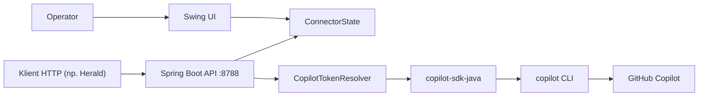

# Herald Copilot Connector

Lokalny connector desktopowy, który wystawia HTTP API do komunikacji z GitHub Copilot i jednocześnie udostępnia prosty interfejs Swing do włączenia/wyłączenia integracji oraz podania tokena GitHub.

Projekt jest zbudowany na Spring Boot i `copilot-sdk-java`. W praktyce działa jako lekka warstwa pośrednia pomiędzy klientem HTTP (np. aplikacją Herald) a GitHub Copilot, z naciskiem na tryb chat-only i prostą obsługę rozmów.

## Spis treści

- [Cel projektu](#cel-projektu)
- [Architektura w skrócie](#architektura-w-skrocie)
- [Najważniejsze cechy](#najwazniejsze-cechy)
- [Wymagania](#wymagania)
- [Uruchomienie](#uruchomienie)
- [Obsługa w UI](#obsluga-w-ui)
- [Model uwierzytelniania](#model-uwierzytelniania)
- [Endpointy API](#endpointy-api)
- [Kontrakt i ograniczenia API](#kontrakt-i-ograniczenia-api)
- [Bezpieczeństwo i wdrożenie](#bezpieczenstwo-i-wdrozenie)
- [Troubleshooting](#troubleshooting)
- [Rozwój i build](#rozwoj-i-build)

## Cel projektu

`Herald Copilot Connector` nie jest klasycznym backendem SaaS ani pełnym serwerem OpenAI-compatible API. To lokalny proces desktopowy, który:

- uruchamia HTTP API na porcie `8788`,
- automatycznie otwiera okno Swing do podania tokena GitHub PAT,
- pozwala aplikacji klienckiej wykonywać zapytania do GitHub Copilot,
- rozróżnia dwa tryby rozmowy:
  - stateless (`/chat/completions`) - każde wywołanie niesie pełny kontekst,
  - stateful explain (`/chat/explain/completions`) - backend utrzymuje sesję rozmowy po `conversationId`.

To rozwiązanie jest szczególnie przydatne wtedy, gdy aplikacja kliencka ma korzystać z Copilota przez stabilny, lokalny endpoint HTTP, zamiast integrować się bezpośrednio z CLI albo SDK.

## Architektura w skrócie



Najważniejsze elementy rozwiązania:

- Spring Boot wystawia REST API.
- UI Swing uruchamia się automatycznie po starcie aplikacji.
- Token GitHub może pochodzić z nagłówków HTTP albo z tokena wprowadzonego w UI.
- Po stronie Copilota używany jest `copilot-sdk-java`, skonfigurowany do pracy w trybie chat-only.
- Dla endpointu explain sesje są utrzymywane po stronie backendu i wygasają po 30 minutach bezczynności.

## Najważniejsze cechy

- Lokalny connector HTTP do GitHub Copilot.
- Tryb stateless i stateful dla rozmów.
- Obsługa listy modeli przez `GET /models`.
- Proste healthchecki przez `GET /healthz`.
- Możliwość zapisania tokena lokalnie na Windows z użyciem DPAPI.
- Globalnie włączony CORS dla metod `GET`, `POST`, `DELETE`, `OPTIONS`.
- Blokada narzędzi, terminala, plików, weba i MCP po stronie sesji Copilot.

## Wymagania

### Runtime

- Java 21
- Środowisko z GUI, ponieważ aplikacja uruchamia okno Swing
- GitHub Fine-Grained Personal Access Token z uprawnieniem `Copilot requests`
- Dostępny executable `copilot` w `PATH`

Ostatni punkt wynika z konfiguracji klienta Copilot w kodzie: aplikacja ustawia `cliPath` na `copilot`, więc proces startowy musi mieć do niego dostęp.

### System operacyjny

- Windows jest platformą preferowaną, jeśli chcesz zapisywać token lokalnie.
- Na systemach innych niż Windows aplikacja nadal może działać, ale zapamiętywanie tokena jest wyłączone.

## Uruchomienie

### 1. Start z kodu źródłowego

```bash
mvn -q -DskipTests package
java -jar target/herald-copilot-connector-0.1.0.jar
```

Alternatywnie:

```bash
mvn spring-boot:run
```

### 2. Start z gotowego artefaktu

W repozytorium znajduje się skrypt `Start.cmd`, ale zakłada on, że plik `herald-copilot-connector-0.1.0.jar` leży w tym samym katalogu co skrypt. To wygodna opcja dla dystrybucji binarnej, ale nie dla standardowego układu Maven `target/`.

### 3. Port

Domyślny port aplikacji to:

```text
8788
```

Port jest ustawiony zarówno w `application.yml`, jak i jako domyślna właściwość startowa aplikacji. W razie potrzeby można go nadpisać standardowym mechanizmem Spring Boot, np.:

```bash
java -jar target/herald-copilot-connector-0.1.0.jar --server.port=8080
```

## Obsługa w UI

Po uruchomieniu aplikacji otwiera się okno `Herald Copilot Connector`.

### Standardowy flow operatora

1. Wklej GitHub PAT.
2. Opcjonalnie zaznacz zapis tokena lokalnie.
3. Kliknij `Połącz connector`.
4. Po aktywacji endpoint `GET /healthz` zacznie zwracać `200 OK`.

### Co robi UI

- przechowuje stan włączenia connectora,
- pozwala zatrzymać connector bez zamykania aplikacji,
- może załadować wcześniej zapisany token z lokalnego profilu użytkownika,
- czyści token z pamięci przy wyłączeniu connectora albo zamknięciu okna.

### Lokalny storage tokena

Na Windows token jest zapisywany w:

```text
%USERPROFILE%\.herald-copilot-connector\copilot-token.dpapi
```

Token jest szyfrowany lokalnie przez DPAPI i związany z profilem użytkownika Windows.

## Model uwierzytelniania

API działa tylko wtedy, gdy connector jest aktywny w UI.

Aplikacja nie korzysta z trybu "logged-in user" po stronie Copilot CLI. W kodzie jawnie wyłączono ten mechanizm, więc należy zakładać pracę wyłącznie na explicite podanym tokenie GitHub.

### Kolejność źródeł tokena

Przy każdym żądaniu backend szuka tokena w tej kolejności:

1. Nagłówek `Authorization: Bearer <token>`
2. Nagłówek `X-GitHub-Token: <token>`
3. Token zapisany aktualnie w stanie connectora po stronie UI

Jeżeli nagłówek jest obecny, ma pierwszeństwo przed tokenem zapisanym w UI.

### Walidacja tokena

- Po stronie API wykonywany jest podstawowy sanity check.
- Po stronie UI walidacja jest bardziej restrykcyjna i oczekuje prefiksu `github_pat`.

### Ważne

Jeżeli connector jest wyłączony, API zwraca `503 Service Unavailable`, nawet jeśli proces JVM działa poprawnie.

## Endpointy API

### Przegląd

| Metoda | Ścieżka | Cel | Stanowość |
| --- | --- | --- | --- |
| `GET` | `/healthz` | Healthcheck connectora | Stateless |
| `GET` | `/models` | Lista modeli dostępnych dla tokena | Stateless |
| `POST` | `/chat/completions` | Jednorazowe zapytanie chatowe | Stateless |
| `POST` | `/chat/explain/completions` | Rozmowa utrzymywana po `conversationId` | Stateful |
| `DELETE` | `/chat/explain/sessions/{conversationId}` | Jawne zamknięcie sesji explain | Stateful |

### `GET /healthz`

Sprawdza, czy connector jest aktywny z perspektywy aplikacji klienckiej.

Endpoint nie wymaga tokena.

#### Odpowiedzi

- `200 OK` z body `ok` - connector jest włączony
- `503 Service Unavailable` z body `not_started` - connector jest wyłączony

#### Przykład

```bash
curl http://localhost:8788/healthz
```

### `GET /models`

Zwraca listę modeli dostępnych dla aktualnego tokena GitHub Copilot.

#### Wymagania

- connector musi być włączony,
- żądanie musi mieć dostęp do poprawnego tokena,
- klient Copilot musi dać się uruchomić.

#### Przykład

```bash
curl -H "Authorization: Bearer <GITHUB_PAT>" \
  http://localhost:8788/models
```

#### Przykładowa odpowiedź

```json
[
  {
    "id": "gpt-5",
    "name": "GPT-5",
    "capabilities": {
      "...": "..."
    },
    "policy": {
      "...": "..."
    },
    "billing": {
      "...": "..."
    },
    "supportedReasoningEfforts": [
      "low",
      "medium",
      "high",
      "xhigh"
    ],
    "defaultReasoningEffort": "medium"
  }
]
```

To nie jest odpowiedź w formacie OpenAI `{"object":"list","data":[...]}`. Endpoint zwraca bezpośrednio tablicę obiektów `ModelInfo`.

### `POST /chat/completions`

Stateless endpoint do pojedynczych odpowiedzi chatowych. Backend za każdym razem tworzy nową sesję Copilot, spłaszcza przekazaną konwersację do jednego promptu tekstowego i zwraca jedną odpowiedź asystenta.

#### Request body

```json
{
  "model": "gpt-5",
  "messages": [
    {
      "role": "system",
      "content": "Odpowiadaj zwięźle."
    },
    {
      "role": "user",
      "content": "Wyjaśnij wzorzec adaptera."
    }
  ],
  "temperature": 0.2,
  "max_tokens": 300,
  "stream": false
}
```

#### Pola

| Pole | Typ | Wymagane | Opis |
| --- | --- | --- | --- |
| `model` | `string` | Nie | Model Copilot do użycia. |
| `messages` | `array` | Tak | Lista wiadomości wejściowych. Backend wymaga tablicy nie-null. |
| `messages[].role` | `string` | Tak | Obsługiwane role: `system`, `user`, `assistant`. |
| `messages[].content` | `string` | Tak | Treść wiadomości. |
| `temperature` | `number` | Nie | Obecnie ignorowane. |
| `max_tokens` | `number` | Nie | Obecnie ignorowane. |
| `stream` | `boolean` | Nie | Obecnie ignorowane. Streaming nie jest wspierany. |

#### Zachowanie

- Wszystkie wiadomości są zamieniane na jeden prompt tekstowy.
- Role są traktowane case-insensitive.
- Każde wywołanie jest niezależne od poprzedniego.
- Odpowiedź zawsze zawiera pojedynczy element `choices[0]`.
- `finish_reason` jest ustawiane na `stop`.
- Jeżeli `model` nie zostanie podany, pole `model` w odpowiedzi może pozostać `null`.

#### Przykład

```bash
curl -X POST http://localhost:8788/chat/completions \
  -H "Content-Type: application/json" \
  -H "Authorization: Bearer <GITHUB_PAT>" \
  -d '{
    "model": "gpt-5",
    "messages": [
      { "role": "system", "content": "Odpowiadaj po polsku." },
      { "role": "user", "content": "Napisz krótkie podsumowanie wzorca CQRS." }
    ]
  }'
```

#### Przykładowa odpowiedź

```json
{
  "id": "chatcmpl_4b0e5b1a-8a4d-4f79-bb31-4c9c93dc7f8c",
  "object": "chat.completion",
  "created": 1711280000,
  "model": "gpt-5",
  "choices": [
    {
      "index": 0,
      "message": {
        "role": "assistant",
        "content": "CQRS rozdziela operacje odczytu i zapisu..."
      },
      "finish_reason": "stop"
    }
  ]
}
```

### `POST /chat/explain/completions`

Stateful endpoint do rozmów, które mają zachowywać kontekst po stronie backendu. Każda rozmowa jest identyfikowana przez `conversationId`.

To jest właściwy endpoint dla scenariusza "kontynuuj rozmowę o tym samym problemie", bez konieczności budowania pełnej sesji po stronie klienta przy każdym wywołaniu.

#### Request body

```json
{
  "conversationId": "ticket-1234-thread-a",
  "model": "gpt-5",
  "messages": [
    {
      "role": "system",
      "content": "Wyjaśniaj zagadnienia backendowe prostym językiem."
    },
    {
      "role": "user",
      "content": "Co robi ten serwis?"
    }
  ],
  "reset": false
}
```

#### Pola

| Pole | Typ | Wymagane | Opis |
| --- | --- | --- | --- |
| `conversationId` | `string` | Tak | Stabilny identyfikator rozmowy. |
| `model` | `string` | Nie | Model powiązany z sesją explain. |
| `messages` | `array` | Tak | Wiadomości wejściowe. |
| `reset` | `boolean` | Nie | Gdy `true`, stara sesja dla `conversationId` jest zamykana i tworzona od nowa. |

#### Zachowanie sesji

- Pierwsze wywołanie dla danego `conversationId` tworzy nową sesję Copilot.
- Jeżeli `reset=true`, poprzednia sesja jest zamykana przed obsługą żądania.
- Dla nowej sesji backend wysyła do Copilota pełną spłaszczoną konwersację.
- Dla istniejącej sesji backend bierze przede wszystkim ostatnią wiadomość `user` i traktuje ją jako kolejny prompt.
- Jeżeli nie znajdzie ostatniej wiadomości `user`, użyje fallbacku w postaci pełnej spłaszczonej konwersacji.
- Sesje wygasają po 30 minutach bezczynności.
- Zmiana tokena albo modelu dla tego samego `conversationId` powoduje wymianę sesji na nową.

#### Bardzo ważna uwaga integracyjna

Jeżeli klient zmienia system prompt, wcześniejszy kontekst albo chce logicznie rozpocząć rozmowę od nowa, powinien:

- ustawić `reset=true`, albo
- wykonać `DELETE /chat/explain/sessions/{conversationId}` i dopiero potem zacząć nową rozmowę.

Bez tego backend może wykorzystać istniejącą sesję i zignorować część historycznych wiadomości, skupiając się głównie na ostatnim komunikacie użytkownika.

#### Przykład

```bash
curl -X POST http://localhost:8788/chat/explain/completions \
  -H "Content-Type: application/json" \
  -H "Authorization: Bearer <GITHUB_PAT>" \
  -d '{
    "conversationId": "analysis-42",
    "model": "gpt-5",
    "messages": [
      { "role": "system", "content": "Tłumacz kod krok po kroku." },
      { "role": "user", "content": "Wyjaśnij mi, jak działa ten kontroler." }
    ]
  }'
```

#### Przykładowa odpowiedź

Format odpowiedzi jest taki sam jak dla `POST /chat/completions`.

### `DELETE /chat/explain/sessions/{conversationId}`

Jawnie zamyka sesję explain skojarzoną z danym `conversationId`.

Endpoint nie wymaga tokena i nie sprawdza, czy connector jest aktualnie włączony. Operacja odbywa się lokalnie po samym `conversationId`.

#### Kiedy używać

- po zakończeniu rozmowy,
- przed restartem flow po stronie UI klienta,
- po zmianie system prompta albo modelu,
- gdy chcesz szybciej zwolnić zasoby zamiast czekać na TTL.

#### Odpowiedź

- `204 No Content`
- Operacja jest praktycznie idempotentna: jeśli sesja nie istnieje, backend również kończy żądanie bez błędu.

#### Przykład

```bash
curl -X DELETE \
  -H "Authorization: Bearer <GITHUB_PAT>" \
  http://localhost:8788/chat/explain/sessions/analysis-42
```

## Kontrakt i ograniczenia API

### To jest API częściowo OpenAI-like, ale nie full-compatible

Najważniejsze różnice względem klasycznego `POST /v1/chat/completions`:

- ścieżka to `/chat/completions`, a nie `/v1/chat/completions`,
- endpoint `/models` nie zwraca wrappera `data`,
- `temperature`, `max_tokens` i `stream` są obecnie ignorowane,
- odpowiedź zawsze zawiera jedną wiadomość asystenta,
- brak wsparcia dla tool calls, function calling, attachments i streamingu SSE.

### Tryb chat-only

Sesje Copilot są uruchamiane z dodatkowymi ograniczeniami:

- brak dostępu do narzędzi,
- brak dostępu do terminala,
- brak dostępu do plików i edycji plików,
- brak dostępu do weba,
- brak dostępu do MCP.

To celowe ograniczenie, które upraszcza integrację i redukuje powierzchnię ryzyka.

### Timeouty i charakter wywołań

- start klienta Copilot: do 30 sekund,
- pobieranie modeli: do 30 sekund,
- oczekiwanie na odpowiedź chat: do 5 minut.

Wywołania są synchroniczne z perspektywy klienta HTTP.

### Rekomendacje integracyjne

- Dla prostych zapytań one-shot używaj `/chat/completions`.
- Dla rozmów wieloturowych używaj `/chat/explain/completions`.
- Traktuj `conversationId` jako unikalny identyfikator jednego wątku rozmowy.
- Unikaj równoległych żądań dla tego samego `conversationId`.

## Bezpieczeństwo i wdrożenie

### Co jest ważne operacyjnie

- Aplikacja nie implementuje własnego uwierzytelniania usługowego.
- CORS jest otwarty globalnie.
- Token może być dostarczany w nagłówku requestu.
- Zamknięcie sesji explain działa lokalnie po `conversationId`, bez autoryzacji nagłówkiem.
- Projekt jest zaprojektowany jako lokalny connector desktopowy, a nie publicznie wystawiony serwis internetowy.

### Rekomendacje wdrożeniowe

- Uruchamiaj aplikację lokalnie na stacji roboczej lub w zaufanej sieci.
- Jeśli potrzebujesz ekspozycji poza localhost, dodaj reverse proxy, TLS, auth i ograniczenia sieciowe.
- Rozważ start z `--server.address=127.0.0.1`, jeśli connector ma być wyłącznie lokalny.
- Nie loguj i nie commituj tokenów.
- Traktuj token GitHub PAT jako sekret produkcyjny.

## Troubleshooting

### `503 Service Unavailable` i komunikat o wyłączonym connectorze

Przyczyna:

- connector nie został aktywowany w UI.

Działanie:

- otwórz okno aplikacji,
- wklej token,
- kliknij `Połącz connector`.

### `401 Unauthorized`

Przyczyna:

- brak tokena,
- niepoprawny format tokena,
- brak aktywnego tokena w UI i brak tokena w nagłówku.

Działanie:

- ustaw `Authorization: Bearer <token>`, albo
- aktywuj connector z poprawnym tokenem w UI.

### `500` z komunikatem `Copilot execution failed`

Typowe przyczyny:

- `copilot` nie jest dostępny w `PATH`,
- token nie ma wymaganych uprawnień,
- konto nie ma dostępu do GitHub Copilot,
- wskazany model nie jest dostępny dla danego tokena,
- klient Copilot nie uruchomił się poprawnie.

### `Start.cmd` nie działa

Przyczyna:

- skrypt oczekuje JAR-a w katalogu głównym obok siebie, a standardowy build Maven odkłada artefakt do `target/`.

Działanie:

- uruchom `java -jar target/herald-copilot-connector-0.1.0.jar`, albo
- przygotuj dystrybucję z JAR-em obok `Start.cmd`.

## Rozwój i build

### Stack technologiczny

- Java 21
- Spring Boot 3.4.2
- `copilot-sdk-java` `0.1.32-java.0`
- Swing + FlatLaf
- JNA / Windows DPAPI

### Build

```bash
mvn -q -DskipTests package
```

### Artefakt

```text
target/herald-copilot-connector-0.1.0.jar
```

## Podsumowanie

To repozytorium dostarcza lokalny, desktopowy connector HTTP do GitHub Copilot z prostym UI operatorskim i dwoma modelami pracy: stateless oraz stateful explain. Najważniejsze z perspektywy integratora są trzy fakty:

- aplikacja musi zostać aktywowana w UI,
- token może pochodzić z nagłówka albo z UI,
- endpoint explain wymaga świadomego zarządzania `conversationId` i resetowaniem sesji.
